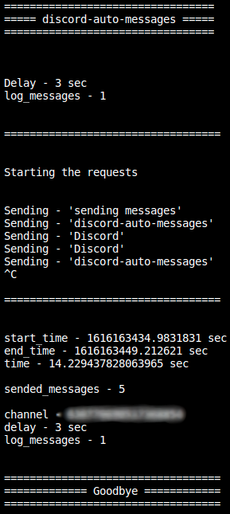

<h1 align="center">
	<a href="https://github.com/Darguima/Mini-Projects/tree/master/discord-auto-messages">
		
	</a>
</h1>

Discord Auto Messages is a simple python script that was created for a random reason on a Discord server. My friends and I started sending spam in the chat to get XP from the MEE6 bot. But I, who was not in the patience to be always there typing, decided to create a python script that would work for me. 

###### Technologies used: Python



## Getting Tokens

### Authorization Token

1. Open Discord on your browser.

2. Press `F12` to open dev tools, and open `Network` tab.

3. Send a random message to anyone.

4. You should see a request on dev tools with file name `messages`. Click on it.

5. On request headers you should see your token after `Authorization`.

### Channel Token

1. Open Discord on your browser.

2. Open the channel/person you want to spam.

3. On the url after the last `/` you have the channel id.

## Running the script

### Requirements

1.  [Python](https://wiki.python.org/moin/BeginnersGuide/Download)
2. Python `requests` Library - `pip install requests`
3. Create a file "token.txt" and paste your Authorization token from Discord in plain text.
4. Write your messages in the tuple `messages` on line 86 of [`main.py`](https://github.com/Darguima/discord-auto-messages/blob/master/main.py).

### Running the bot

```console
$ python main.py {discord channel id} {delay in seconds between messages} {print the message (use 0 to false and 1 to true)}
```
